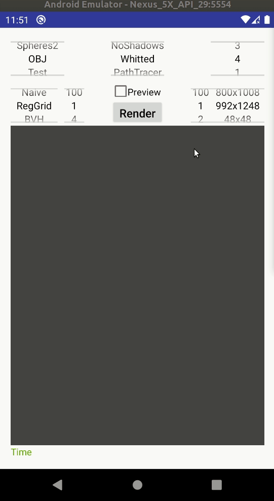

# Ray tracer for Android

## TODO

### Main tasks

* Give out of memory error when the memory is not enough to load the scene
* Implement loading of textures
* Separate Material from Primitive in order to save memory
* Fix memory leak in Java UI
* Add comments in the code
* Fix load of obj files in Android 10