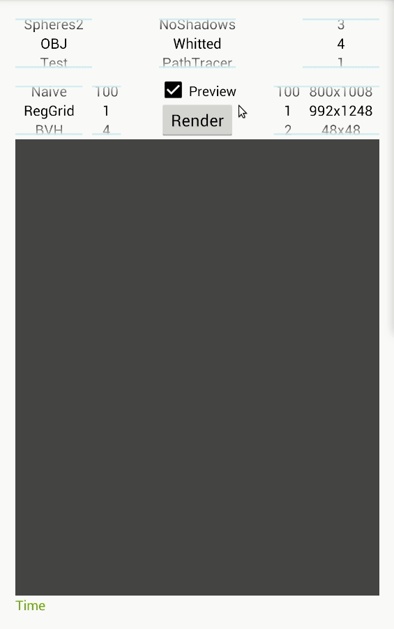

# MobileRT: Mobile Ray Tracing engine <br/>
- A portable Ray Tracing (RT) engine for multiple devices <br/>
- Already available interfaces for Android and Linux <br/>

[comment]: # (Licenses and documentation)
[](https://raw.githubusercontent.com/TiagoMSSantos/MobileRT/master/LICENSE)
[](https://app.fossa.io/projects/git%2Bgithub.com%2FTiagoMSSantos%2FMobileRT?ref=badge_shield)
[](https://snyk.io/test/github/TiagoMSSantos/MobileRT?targetFile=app/build.gradle)
[](https://codedocs.xyz/TiagoMSSantos/MobileRT/)

[comment]: # (Continuous Integration & Code coverage)
[](https://github.com/TiagoMSSantos/MobileRT/actions)
[](https://github.com/TiagoMSSantos/MobileRT/actions)
[](https://codecov.io/gh/TiagoMSSantos/MobileRT)
[](https://codeclimate.com/github/TiagoMSSantos/MobileRT/test_coverage)

[comment]: # (Static analysis)
[](https://bettercodehub.com/results/TiagoMSSantos/MobileRT)
[](https://codeclimate.com/github/TiagoMSSantos/MobileRT/maintainability)
[](https://codebeat.co/projects/github-com-tiagomssantos-mobilert-master)
[](https://tiagomssantos.github.io/MobileRT/jscpd-report/jscpd-report)
[](https://app.codacy.com/manual/TiagoMSSantos/MobileRT?utm_source=github.com&utm_medium=referral&utm_content=TiagoMSSantos/MobileRT&utm_campaign=Badge_Grade_Settings)





## Run docker image
This C++ Ray Tracer is compatible with Android and Linux. <br/>

For Linux, if [docker](https://www.docker.com/) is installed, it is possible to
try this ray tracer with ease by using the following commands to get the docker
image and execute the container: <br/>
```bash
docker pull ptpuscas/mobile_rt
xhost +; docker run -v /tmp/.X11-unix:/tmp/.X11-unix -e DISPLAY=${DISPLAY} -it ptpuscas/mobile_rt
```
And a docker container should start and render the conference room model like
the image above :) <br/>

## Build docker image
For the most curious, this is the command used to build the docker image:
```bash
docker build -t ptpuscas/mobile_rt -f docker_image/Dockerfile --no-cache=false --build-arg build_type=Release .
```

## Compile Ray tracer
It is also possible to clone this repository and compile this ray tracer by
yourself.
To compile it, it is essential to install cmake and have a C++11 compiler.
It is also needed the [Qt4](https://www.qt.io/) library and the
[git](https://git-scm.com/) control system to get the code from the repository.
<br/>
```bash
sudo apt-get update
sudo apt-get install cmake libqt4-dev build-essential ca-certificates git g++
```
Then, to finally compile this code, just create a build directory and compile
in it, like for example:
```bash
mkdir build_Release
cmake -DCMAKE_VERBOSE_MAKEFILE=ON -DCMAKE_CXX_COMPILER=g++ -DCMAKE_BUILD_TYPE=Release ../app/
```

## Run Ray tracer
This ray tracer comes with a script with many functionalities useful to run
static code analyzers and to benchmark the ray tracer itself.
To execute the ray tracer just use the profile.sh script available in the
Scripts directory.
For example, inside the build_Release directory (which should be inside the root
folder of this project) that contains all the object files compiled previously,
the following command should start the ray tracer: <br/>
```bash
../Scripts/profile.sh Release
```

## Android
To try this ray tracer for Android just download the
[APK](https://github.com/TiagoMSSantos/MobileRT/blob/master/app/release/app-release.apk?raw=true)
file available in the repository.

## Models Wavefront OBJ
To get some OBJ models, just download some from here:
[OBJs](https://casual-effects.com/data/).
Then, it will just be needed to add some lights in the scene geometry, by using
some modeling application like [3D Blender](https://www.blender.org/).
One thing to have it in account is to make sure the light material has the
light emission component (Ke) with some positive values in the ".mtl" file.
Finally, add a camera file with the extension ".cam" that should contain a
definition of a perspective camera, like for example:
```
t perspective #type of the camera
p 0 0 0 #position of the camera x y z
l 0 0 1 #look at of the camera x y z
u 0 1 0 #up vector of the camera x y z
f 45 45 #field of view of the camera u v
```


## Third party frameworks / libraries used
- [x] C++ [Boost libraries](https://www.boost.org/)
- [x] C++ [OpenGL Mathematics](https://glm.g-truc.net/0.9.9/index.html)
library
- [x] C++ [tinyobjloader](https://github.com/tinyobjloader/tinyobjloader)
library
- [x] C++ [Qt4](https://www.qt.io/) framework for Linux interface
- [x] C++ [Google Test](https://github.com/google/googletest) framework
for unit tests
- [x] C [STB libraries](https://github.com/nothings/stb)
- [x] Java [Google Guava](https://github.com/google/guava) libraries
- [x] Java [streams](https://github.com/stefan-zobel/streamsupport) to
reduce complexity
- [x] Java [Apache Commons](https://commons.apache.org/) framework
- [x] Java [JUnit4](https://junit.org/junit4/) framework for
unit tests
- [x] Java [AssertJ](https://assertj.github.io/doc/) library for
unit tests assertions
- [x] Java [Mockito](https://site.mockito.org/) framework for
mocking in unit tests
- [x] Java Google [Truth](https://truth.dev/) library for
unit tests 
- [x] Java Android [Espresso](https://developer.android.com/training/testing/espresso)
library for instrumented tests


## Master's dissertation
This project started as a [Masters' dissertation](Masters_dissertation.pdf).

Click [here](TODO.md) to check the TODO list. <br/>
Click [here](TOOLS.md) to check the code coverage and code duplication commands. <br/>
