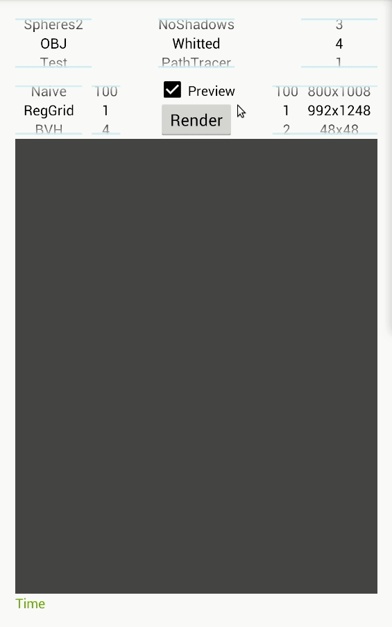

# Mobile Ray Tracer (MobileRT)<br/>
# A portable Ray Tracing (RT) library for Android and Linux



## Run docker image
This C++ Ray Tracer is compatible with Android and Linux.<br/>
For Linux, if you have docker installed, you can try it with ease by using the following
commands to get the docker image and execute the container:<br/>
```bash
docker pull ptpuscas/mobile_rt
xhost +; docker run -v /tmp/.X11-unix:/tmp/.X11-unix -e DISPLAY=${DISPLAY} -it ptpuscas/mobile_rt
```
And you should see a the conference room model like the image above :)<br/>

## Build docker image
```bash
docker build -t ptpuscas/mobile_rt -f docker_image/Dockerfile --no-cache=false --build-arg build_type=Release .
```

## Compile Ray tracer
To Compile this ray tracer, you need to install cmake and have a C++ compiler.
You will also need the QT4 library and of course the git.<br/>
```bash
sudo apt-get update
sudo apt-get install cmake libqt4-dev build-essential ca-certificates git g++ libgtk2.0-dev
```
Then, to compile this code, just create a build directory and compile it, like
for example:
```bash
mkdir build_Release
cmake -DCMAKE_VERBOSE_MAKEFILE=ON -DCMAKE_CXX_COMPILER=g++ -DCMAKE_BUILD_TYPE=Release ../app/
```

## Run Ray tracer
To try this ray tracer just use the profile.sh script available in the Scripts
directory. For example, you can just type inside the created build_Release
directory, the following command:<br/>
```bash
../Scripts/profile.sh Release
```

## Android
To try this ray tracer for Android just download the
[APK](https://github.com/TiagoMSSantos/MobileRT/blob/master/app/release/app-release.apk?raw=true) file available in the
repository.

## Models OBJ
To get some OBJ models, just download some from here: [OBJs](https://casual-effects.com/data/).
Then you need to add some lights, like for example with 3D Blender.
Just make sure the light material has the light emission component (Ke) with some positive values in the MTL file.
Finally, add a CAM file with some contents like below to have a perspective camera:
```
t perspective #type of the camera
p 0 0 0 #position of the camera x y z
l 0 0 1 #look at of the camera x y z
u 0 1 0 #up vector of the camera x y z
f 45 45 #field of view of the camera u v
```

## TODO

### Ray tracing engine
- [x] Implement loading of textures
- [ ] Add support for textures for different materials
- [x] Separate Material from Primitive in order to save memory
- [x] Improve BVH
- [x] Improve Regular Grid
- [ ] Add ray packet intersections
- [ ] Optimize BVH with ray packet intersections
- [ ] Add gpu ray tracing support for comparison
- [ ] Add more types of shapes
- [ ] Support more types of models besides .obj files
- [x] Move naive acceleration structure to a class different than Scene
- [ ] Implement KD-Tree
- [ ] Make acceleration structures compatible with the lights
- [ ] Investigate if samplers are properly working
- [x] Add exceptions
- [x] Check all allocations' exceptions
- [x] Add normals per vertice for triangles
- [x] Improve loading of textures
- [ ] Parallelize build of Regular Grid
- [ ] Parallelize build of BVH
- [x] Add support for C++ Boost
- [x] Add message to assertions
- [ ] Optimize loading of scene

### Ray tracing JNI layer
- [ ] Refactor DrawView translation unit
- [ ] Remove duplicated code from different layers
- [ ] Improve DrawView code readability
- [ ] Remove race conditions

### Ray tracing shaders
- [ ] Fix refraction
- [ ] Fix Path Tracing algorithm
- [ ] Improve shaders performance
- [ ] Add Bidirectional Path Tracing
- [ ] Add Metropolis light transport
- [ ] Add shader for debug purposes (wireframe of shapes and boxes)

### Ray tracing test cases
- [ ] Prepare more scene models with Blender for testing
- [x] Read and construct lights and cameras from files
- [x] Remove unnecessary primitives, lights and cameras in the code

### Android Interface
- [x] Fix memory leak in Java UI
- [x] Fix load of obj files in Android 10
- [ ] Improve Java UI code to more Object Oriented
- [ ] Change Android icon
- [x] Add compiler warnings in Gradle
- [x] Remove usage of deprecated methods
- [x] Add Android instrumented unit tests
- [ ] Make Android instrumented tests run on debug and release
- [ ] Make all Android instrumented tests pass without flakiness
- [x] Use java streams to reduce complexity

### Linux Interface
- [x] Change Linux's UI from GTK to Qt
- [ ] Add options in Qt UI

### System
- [x] Add javadoc in the Android UI
- [ ] Add documentation in the JNI layer
- [x] Add documentation in the MobileRT
- [x] Give out of memory error when the memory is not enough to load the scene
- [ ] Add unit tests (more code coverage)
- [x] Add git hooks to check git commit messages
- [x] Add git hooks to submit Jenkins' jobs after each git push
- [ ] Support to export rendered image to file
- [x] Add CI / CD support from github (actions) for the Google Test unit tests
- [ ] Add support for a tool to detect duplicated code
- [ ] Remove Java duplicated code
- [ ] Remove C++ duplicated code
- [ ] Remove unnecessary casts

### Docker
- [x] Make a docker image with MobileRT
- [x] Add an example model to the docker container
- [ ] Use docker compose to launch multiple containers and distribute the load

### Documentation
- [x] Improve README
- [ ] Write documentation
- [x] Update gif image
- [ ] Benchmark against popular ray tracers like PBRT
- [ ] Benchmark against previous version of MobileRT
